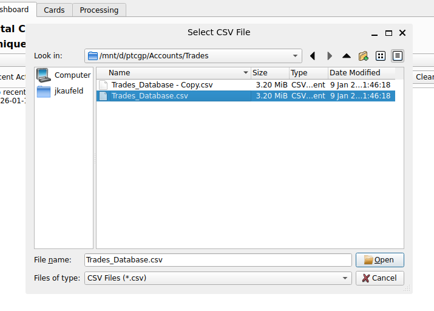
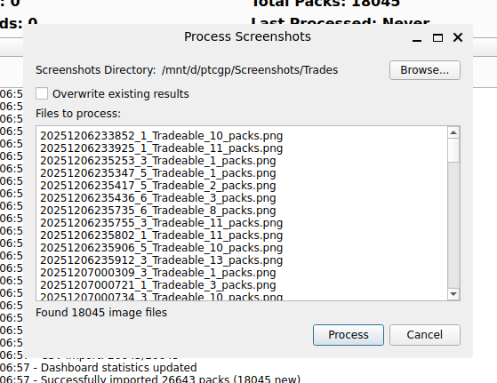
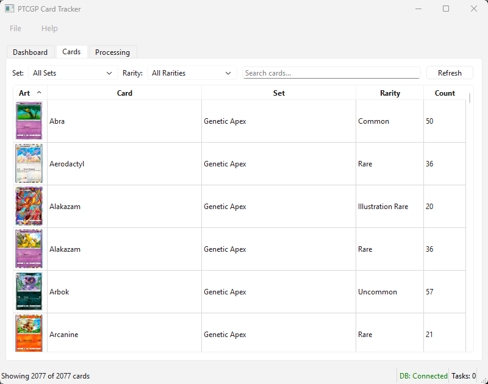
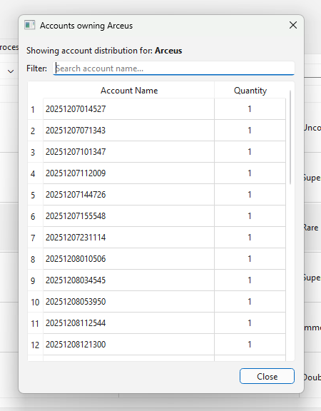

# PTCGPB Companion

tl;dr: This is a companion desktop app that works with [PTCGPB](https://github.com/kevnITG/PTCGPB) to help you find what cards are in what accounts. 

## The Background

When trying to put together more complex decks, I found myself really wishing for a way to find cards of lesser rarity that PTCGPB doesn't track. Loading every account and logging every card would be more time and effort than it's worth, especially as the scripts run. Hence, PTCGPB Companion.

> This app parses screenshots taken by the S4T functionality and recognizes all the cards in each screenshot, tracking them in a database and marking which card is in which account.

I've been using different versions of this application over the past few weeks as of this writing, and I'm very pleased with how it's helped me understand what I have in different accounts and whatnot. Hopefully it's helpful for you, too!

## Instructions

### GitHub Releases

Download the latest release [from the releases page](https://github.com/itsthejoker/ptcgpb_companion/releases). Unzip the .exe and the _internal folder to a common directory. This is a portable application, so there's nothing to install. Doubleclick the .exe file to start the app.

### Manually

You will need Python 3.14+ and `uv` installed. Clone this repo first, then run `uv sync`. Use the run.bat/run.sh commands to start the app.

## Note on First Run

The first time you launch the application, it will set up the directories and data that it needs (everything in the `_internal` folder) and then begin immediately downloading the card art that it needs. This will likely take a minute or so depending on your internet connection. The window may not show up for a few seconds on the first run; future runs are much faster.

## Adding Cards

The first thing you'll need to do is add your S4T CSV file. You can find this in {the directory you have ptcgpb in}\Accounts\Trades. For me, this value is `D:\ptcgp\Accounts\Trades\Trades_Database.csv`. Click on the `Import CSV` button (or File -> Import CSV) and navigate to where your Trades Database is.

Once it's selected, click "Import" and it will begin parsing. Once you get a message that says "CSV Import Finished" and the Tasks count has gone back to zero, you can begin importing your images.

Click on `Load Screenshots` and navigate to your Trades directory. For me, it's `D:\ptcgp\Screenshots\Trades`. Select the Trades directory itself. It will start processing when you submit the path.

> [!IMPORTANT]  
> IMPORTS ARE NOT FAST. I've done my best to balance between accuracy and speed, but you cannot have both. In my testing, it can load about one pack a second, or 60 screenshots per minute. 

My advice is to let this run in the background, potentially overnight, if you have a large collection of screenshots that need to be processed.

## The Cards View

You can view all the cards you have across accounts in the `Cards` tab. This is accessible while imports are running. You can scroll through the list or filter for the particular card you're looking for.

Clicking on the art for any card will show the card art in high resolution. Press Esc or click the X to close it.

Click on the rest of the row to show all the accounts that have that card in them.

Copy the value of any one of these accounts and do a search via the Account Injector in PTCGPB to load the account the normal way.

## Adding More Data

As your bots continue to run, you will naturally amass more trades. You will need to load the CSV first, **then** load the screenshots. The app has a heavy emphasis on caching and quickly checking work that has been done before; it takes roughly 1 second to tell me that all 18,000 of my screenshots have already been processed and there are no new ones.

## Development

You will need Python 3.14+ and `uv`. `black` for formatting. Development is primarily done in Ubuntu / WSL2, but can be done in Windows as well.

Prerequisites:
- uv installed (see https://docs.astral.sh/uv/)
- zip utility (e.g., sudo apt-get install zip)

Steps:
1. Make the build script executable:
   - `chmod +x ./build-linux.sh` (linux only)
2. Run the build:
   - `./build-linux.sh`
   - `./build-windows.bat` on Windows machines

What it does:
- Invokes PyInstaller via `uvx` to create an onedir bundle for the PyQt6 app with required assets.
- Packages the result as `dist/<name>-<version>-<architecture>.zip`.

Run the packaged app (Linux):
- `unzip dist/<name>-<version>-linux.zip`
- `./<name>/<name>`

Run the packaged app (Windows):
- Unzip the provided dist file
- doubleclick exe file

Notes:
- Entry point is `main.py` (PyQt6 GUI).
- There are no assets included. Card images are downloaded on first launch.
- You can override the output name/version: `APP_NAME=applin APP_VERSION=0.1.0 ./build-linux.sh`
